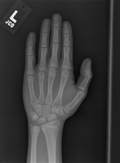
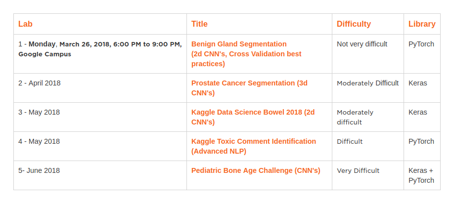
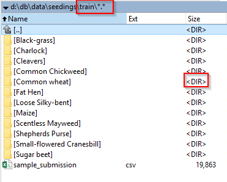

# 12 Applied Deep Learning Labs, 2018

## Tel Aviv Deep Learning Bootcamp : http://deep-ml.com



# Full schedule:
Refer to: 
https://www.evernote.com/shard/s341/sh/3855640e-2b0b-42e5-b5b9-00216d02ac9a/b47968226e49a81ee813901cd41d3924



Contact: Shlomo Kashani at shlomo@bayesian.io 

# Google Collab + PyTorch:
- https://colab.research.google.com/drive/1y0pgDW_0r4tPSk6URgWc3UekejIKBxDd


### About
Tel-Aviv Deep Learning Bootcamp is an intensive (and free!) 5-day program intended to teach you all about deep learning. It is nonprofit focused on advancing data science education and fostering entrepreneurship. The Bootcamp is a prominent venue for graduate students, researchers, and data science professionals. It offers a chance to study the essential and innovative aspects of deep learning.	

Participation is via a donation to the A.L.S ASSOCIATION for promoting research of the Amyotrophic Lateral Sclerosis (ALS) disease. 

#### Registration:
You can register, however we reserve no places, folowing a first come first serve policy. 

### Requirements

- Ubuntu Linux 16.04, Mac OSX or Windows 10
- Python 3.5 or above 
- CUDA 9.0 drivers.
- cuDNN 7.0.

- [pytorch](https://github.com/pytorch/pytorch) >= 0.2.0
- [torchvision](https://github.com/pytorch/vision) >= 0.1.8
- [Pillow](https://github.com/python-pillow/Pillow)
- [scipy](https://github.com/scipy/scipy)
- [tqdm](https://github.com/tqdm/tqdm)
- Keras

## Data Sets in PyTorch 
Keep in mind that this repository expects data to be in same format as Imagenet. I encourage you to use your own datasets. 
In that case you need to organize your data such that your dataset folder has EXACTLY two folders. Name these 'train' and 'val'

**The 'train' folder contains training set and 'val' fodler contains validation set on which accuracy / log loss is measured.**  

The structure within 'train' and 'val' folders will be the same. 
They both contain **one folder per class**. 
All the images of that class are inside the folder named by class name; this is crucial in PyTorch. 

If your dataset has 2 classes like in the Kaggle Statoil set, and you're trying to classify between pictures of 1) ships 2) Icebergs, 
say you name your dataset folder 'data_directory'. Then inside 'data_directory' will be 'train' and 'test'. 
Further, Inside 'train' will be 2 folders - 'ships', 'icebergs'. 

## So, the structure looks like this: 



```
|-  data_dir
       |- train 
             |- ships
                  |- ship_image_1
                  |- ship_image_2
                         .....

             |- ice
                  |- ice_image_1
                  |- ice_image_1
                         .....
       |- val
             |- ships
             |- ice
```

For a full example refer to: https://github.com/QuantScientist/Deep-Learning-Boot-Camp/blob/master/Kaggle-PyTorch/PyTorch-Ensembler/kdataset/seedings.py 


## IDE

This project has been realised with [*PyCharm*](https://www.jetbrains.com/pycharm/) by *JetBrains*

# Relevant info:

http://deep-ml.com/

## Author
Shlomo Kashani/ [@QuantScientist](https://github.com/bayesianio) and many more. 

